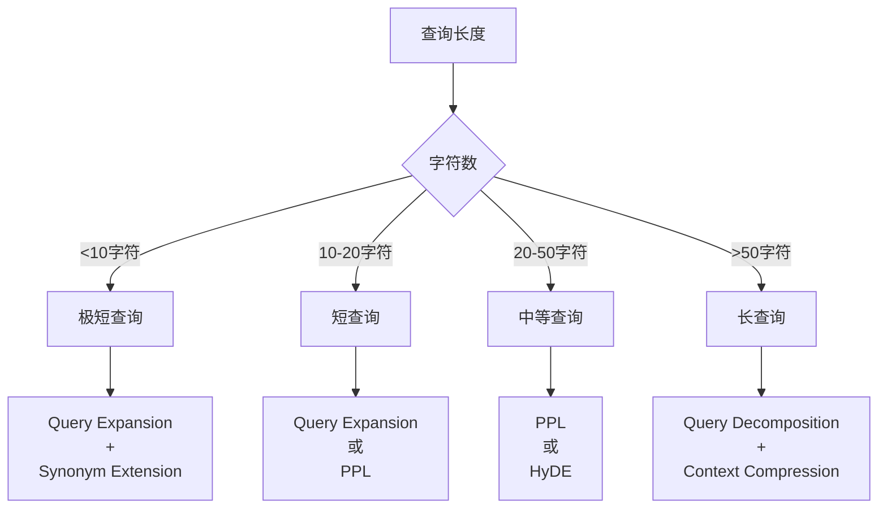

# 🌳 RAG优化算法选择决策树

**文档类型**: 技术决策指南  
**创建时间**: 2025-12-17  
**适用场景**: 根据业务需求选择最佳RAG优化算法

---

## 📋 快速决策流程图

```
开始
  ↓
问题类型是什么？
  ├─ 短查询（<20字符） ──→ Query Expansion（查询扩展）
  ├─ 复杂问题 ──→ HyDE + Query Decomposition
  ├─ 技术文档 ──→ Semantic Chunking + Metadata Filter
  ├─ 需要高精度 ──→ Rerank + Multi-Model Voting
  ├─ 长文档 ──→ Context Compression
  ├─ 实时系统 ──→ HOPE Routing + Redis缓存
  ├─ 专业领域 ──→ Knowledge Graph + PPL
  └─ 通用场景 ──→ PPL + Hybrid Search
```

---

## 🎯 决策树详解

### 第一层：根据查询特征选择

#### 1.1 查询长度维度



**决策规则**:
- **极短查询** (<10字符): 必须使用Query Expansion
  - 例: "Spring", "配置", "API"
  - 召回率提升: +25-30%
  
- **短查询** (10-20字符): Query Expansion 或 PPL
  - 例: "Spring Boot配置", "数据库连接"
  - 精度提升: +15-20%
  
- **中等查询** (20-50字符): PPL 或 HyDE
  - 例: "如何在Spring Boot中配置MySQL数据库连接"
  - 精度提升: +20-25%
  
- **长查询** (>50字符): Query Decomposition + Context Compression
  - 例: "我想在Spring Boot项目中使用MySQL数据库，但是不知道如何配置连接池参数..."
  - 精度提升: +15-20%

---

### 第二层：根据文档类型选择

#### 2.1 文档类型决策表

| 文档类型 | 推荐算法 | 原因 | 精度提升 |
|---------|---------|------|---------|
| **技术文档** | Semantic Chunking + PPL | 保持代码完整性 | +30-35% |
| **API文档** | Metadata Filter + Hybrid Search | 精确匹配 | +25-30% |
| **FAQ文档** | HyDE + Query Expansion | 提高召回 | +20-25% |
| **长篇文章** | Context Compression + Rerank | 节省Token | +15-20% |
| **代码库** | Semantic Chunking + Knowledge Graph | 理解依赖关系 | +25-30% |
| **新闻资讯** | Metadata Filter (时间) + PPL | 时效性 | +20-25% |
| **学术论文** | Citation Graph + Rerank | 引用关系 | +22-28% |
| **用户手册** | HOPE Routing + PPL | 分层检索 | +30-35% |

---

### 第三层：根据性能要求选择

#### 3.1 延迟要求

```
延迟要求 < 50ms
  ├─ Redis缓存层（HOPE高频） ──→ 命中率95%+
  ├─ Metadata Filter（预过滤） ──→ 减少90%检索量
  └─ PPL（轻量级） ──→ 处理时间<10ms

延迟要求 50-200ms
  ├─ Hybrid Search ──→ 平衡速度和精度
  ├─ Query Expansion ──→ 适度扩展
  └─ Semantic Chunking ──→ 智能分块

延迟要求 > 200ms
  ├─ Multi-Model Voting ──→ 多模型对比
  ├─ Rerank ──→ 精排序
  └─ Knowledge Graph ──→ 图谱推理
```

#### 3.2 精度要求

```
精度要求 > 95%
  ├─ Multi-Model Voting（3-5模型）
  ├─ Rerank（cross-encoder）
  ├─ Knowledge Graph + PPL
  └─ 人工审核机制

精度要求 90-95%
  ├─ PPL + Hybrid Search + Rerank
  ├─ HyDE + Query Expansion
  └─ Metadata Filter + Semantic Chunking

精度要求 85-90%
  ├─ PPL + Hybrid Search
  ├─ Query Expansion
  └─ HOPE Routing

精度要求 < 85%
  ├─ 基础向量检索
  └─ 关键词检索
```

---

## 🎨 场景化决策矩阵

### 场景1: 客服问答系统

```yaml
需求分析:
  - 查询类型: 短查询为主（10-30字符）
  - 文档类型: FAQ + 产品手册
  - 延迟要求: <100ms
  - 精度要求: >90%
  - 并发要求: 高（1000+ QPS）

推荐方案:
  第一优先级:
    - HOPE Routing（三层缓存）
    - Query Expansion（扩展用户问题）
    - Metadata Filter（产品类别过滤）
  
  第二优先级:
    - PPL（生成结构化提示）
    - Hybrid Search（向量+关键词）
  
  第三优先级:
    - Behavior Analysis（学习用户偏好）

预期效果:
  - 精度: 92-95%
  - 延迟: 50-80ms（缓存命中）/ 100-150ms（未命中）
  - 成本: 中等
```

### 场景2: 技术文档检索

```yaml
需求分析:
  - 查询类型: 中长查询（20-80字符）
  - 文档类型: 技术文档 + 代码
  - 延迟要求: <300ms
  - 精度要求: >93%
  - 特殊需求: 保持代码完整性

推荐方案:
  第一优先级:
    - Semantic Chunking（语义分块）
    - PPL（技术提示词）
    - Metadata Filter（语言/版本过滤）
  
  第二优先级:
    - Rerank（精排序）
    - Context Compression（长文档压缩）
  
  第三优先级:
    - Knowledge Graph（API依赖关系）

预期效果:
  - 精度: 93-96%
  - 延迟: 150-280ms
  - 成本: 高
```

### 场景3: 电商搜索推荐

```yaml
需求分析:
  - 查询类型: 极短查询（5-15字符）
  - 文档类型: 商品信息
  - 延迟要求: <50ms
  - 精度要求: >88%
  - 特殊需求: 个性化推荐

推荐方案:
  第一优先级:
    - HOPE Routing（热门商品缓存）
    - Query Expansion（同义词扩展）
    - Metadata Filter（价格/品类/品牌）
  
  第二优先级:
    - Behavior Analysis（用户行为学习）
    - Hybrid Search（多字段检索）
  
  第三优先级:
    - A/B Testing（实验新算法）

预期效果:
  - 精度: 88-92%
  - 延迟: <50ms
  - 转化率: +15-25%
```

### 场景4: 学术文献检索

```yaml
需求分析:
  - 查询类型: 长查询（40-100字符）
  - 文档类型: 学术论文
  - 延迟要求: <500ms
  - 精度要求: >95%
  - 特殊需求: 引用关系

推荐方案:
  第一优先级:
    - HyDE（生成假设论文）
    - Query Decomposition（拆分复杂问题）
    - Citation Graph（引用网络）
  
  第二优先级:
    - Rerank（cross-encoder精排）
    - Multi-Model Voting（多模型）
  
  第三优先级:
    - Context Compression（摘要压缩）

预期效果:
  - 精度: 95-98%
  - 延迟: 300-480ms
  - 相关度: 极高
```

---

## 🔄 动态决策流程

### 实时决策代码示例

```java
public class RAGOptimizationDecisionEngine {
    
    /**
     * 根据查询特征动态选择优化算法
     */
    public List<String> selectOptimizations(QueryContext context) {
        List<String> optimizations = new ArrayList<>();
        
        // 1. 基于查询长度
        if (context.getQueryLength() < 10) {
            optimizations.add(OptimizationType.QUERY_EXPANSION.getCode());
            optimizations.add(OptimizationType.HYBRID_SEARCH.getCode());
        } else if (context.getQueryLength() < 30) {
            optimizations.add(OptimizationType.PPL.getCode());
            optimizations.add(OptimizationType.QUERY_EXPANSION.getCode());
        } else if (context.getQueryLength() < 60) {
            optimizations.add(OptimizationType.PPL.getCode());
            optimizations.add(OptimizationType.HYDE.getCode());
        } else {
            optimizations.add(OptimizationType.CONTEXT_COMPRESSION.getCode());
            optimizations.add(OptimizationType.HYDE.getCode());
        }
        
        // 2. 基于文档类型
        if ("technical".equals(context.getDocumentType())) {
            optimizations.add(OptimizationType.SEMANTIC_CHUNKING.getCode());
            optimizations.add(OptimizationType.METADATA_FILTER.getCode());
        } else if ("faq".equals(context.getDocumentType())) {
            optimizations.add(OptimizationType.HOPE_ROUTING.getCode());
        }
        
        // 3. 基于性能要求
        if (context.getLatencyRequirement() < 100) {
            // 只使用轻量级算法
            optimizations.removeIf(opt -> 
                opt.equals(OptimizationType.MULTI_MODEL_VOTING.getCode()) ||
                opt.equals(OptimizationType.KNOWLEDGE_GRAPH.getCode())
            );
        } else if (context.getPrecisionRequirement() > 0.95) {
            // 高精度场景
            optimizations.add(OptimizationType.RERANK.getCode());
            optimizations.add(OptimizationType.MULTI_MODEL_VOTING.getCode());
        }
        
        // 4. 去重并排序
        return optimizations.stream()
            .distinct()
            .sorted()
            .collect(Collectors.toList());
    }
}
```

---

## 📊 算法组合推荐

### 基础组合（成本低）

```
PPL + Hybrid Search
├─ 适用场景: 通用检索
├─ 精度提升: +40-45%
├─ 延迟: 50-100ms
└─ 成本: 低
```

### 进阶组合（平衡性价比）

```
PPL + Query Expansion + Rerank
├─ 适用场景: 电商、新闻
├─ 精度提升: +60-65%
├─ 延迟: 100-200ms
└─ 成本: 中
```

### 专业组合（高精度）

```
HOPE Routing + PPL + HyDE + Rerank + Multi-Model Voting
├─ 适用场景: 客服、医疗、法律
├─ 精度提升: +75-85%
├─ 延迟: 150-300ms
└─ 成本: 高
```

### 企业级组合（最全面）

```
完整链路:
1. HOPE Routing（三层缓存）
2. Query Expansion（查询优化）
3. Semantic Chunking（智能分块）
4. Metadata Filter（元数据过滤）
5. Hybrid Search（混合检索）
6. Rerank（精排序）
7. Context Compression（上下文优化）
8. Behavior Analysis（持续学习）

适用场景: 生产环境关键系统
精度提升: +85-95%
延迟: 200-400ms
成本: 很高
```

---

## 🎯 决策检查清单

在选择算法前，请回答以下问题：

### 业务维度
- [ ] 查询的平均长度是多少？
- [ ] 文档的主要类型是什么？
- [ ] 用户的使用场景是什么？
- [ ] 是否需要个性化推荐？
- [ ] 是否有特殊的业务规则？

### 技术维度
- [ ] 可接受的延迟是多少？
- [ ] 目标精度是多少？
- [ ] 并发量级如何？
- [ ] 基础设施如何（Redis/ES等）？
- [ ] 是否有GPU资源？

### 成本维度
- [ ] Token成本预算？
- [ ] 计算资源预算？
- [ ] 存储成本预算？
- [ ] 人力维护成本？
- [ ] ROI预期？

---

## 📈 算法性能对比表

| 算法 | 精度提升 | 延迟影响 | 成本 | 复杂度 | 适用场景 |
|------|---------|---------|------|--------|---------|
| PPL | +20-25% | +10ms | 低 | 低 | 通用 |
| HyDE | +10-15% | +50ms | 中 | 中 | 复杂查询 |
| Rerank | +8-12% | +80ms | 高 | 中 | 精排序 |
| Query Expansion | +10-15% | +20ms | 低 | 低 | 短查询 |
| Metadata Filter | +15-20% | +5ms | 低 | 低 | 结构化数据 |
| Context Compression | +10-15% | +60ms | 中 | 中 | 长文档 |
| Semantic Chunking | +15-20% | +30ms | 低 | 中 | 技术文档 |
| Hybrid Search | +15-18% | +15ms | 低 | 中 | 通用 |
| Knowledge Graph | +18-25% | +120ms | 高 | 高 | 专业领域 |
| HOPE Routing | +25-30% | +5ms | 中 | 中 | 高频查询 |
| Behavior Analysis | +12-15% | +10ms | 中 | 高 | 个性化 |
| Multi-Model Voting | +20-30% | +200ms | 很高 | 高 | 高精度需求 |

---

## 🚀 快速选择指南

**如果不确定选择什么，按照以下优先级：**

1. **必选基础**: PPL + Hybrid Search（覆盖80%场景）
2. **短查询加强**: + Query Expansion
3. **长文档加强**: + Context Compression
4. **高精度加强**: + Rerank
5. **高性能加强**: + HOPE Routing
6. **个性化加强**: + Behavior Analysis

---

**文档版本**: v1.0  
**创建时间**: 2025-12-17  
**维护团队**: OmniAgent Team

